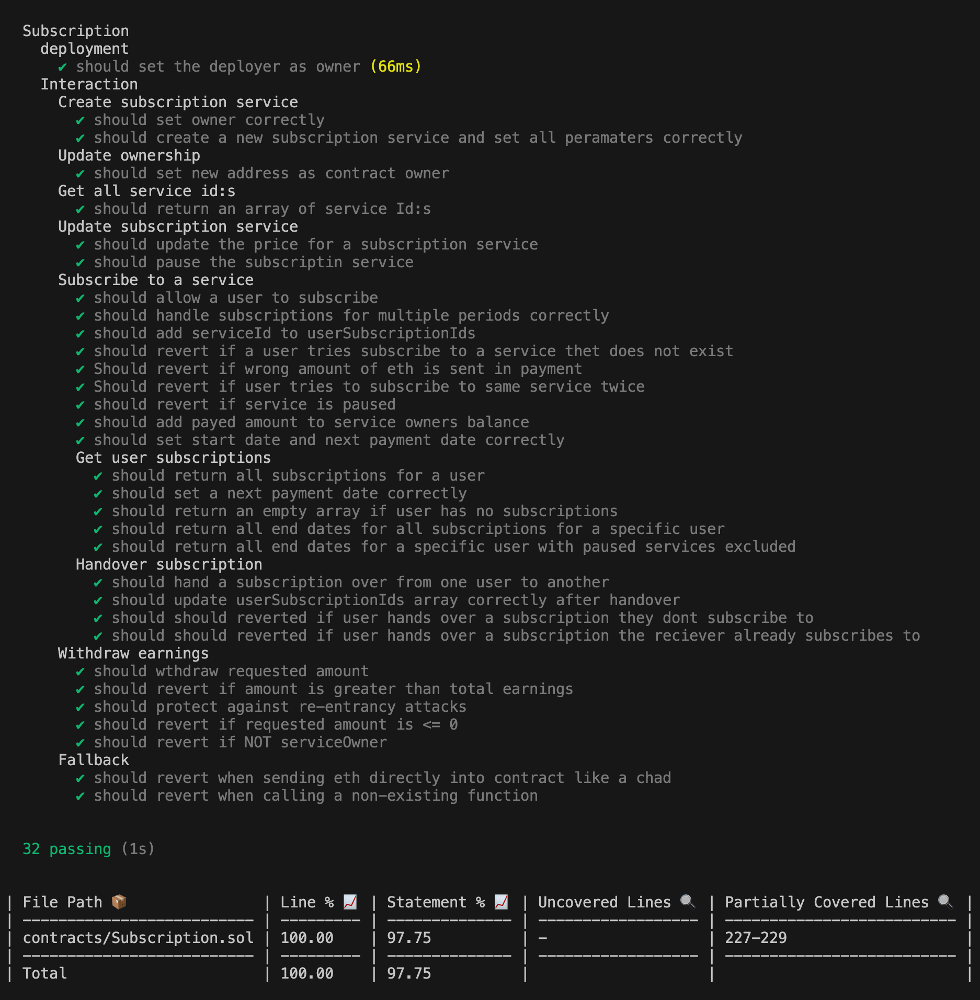

#### GAS opitimization

- Format structs to fit multiple variables into same memory slot because packing reduces the number of storage slots used
- Caching a storage variable in memory, see canSubscribe modifier, because reading from memory is cheaper than reading multiple times from storage
- Use of mapping instead of arrays because arrays are expensive to iterate

#### Safety precautions

- Re-entrancy protection with noReentrancy modifier and updating internal state before making any external calls. Prevents attackers from exploiting by re-entrancy attack
- Reqire modifiers, enforces input validation
- Custom errors (this is also cheaper (GAS) than require + message string) and also enforces input validation

#### Test

